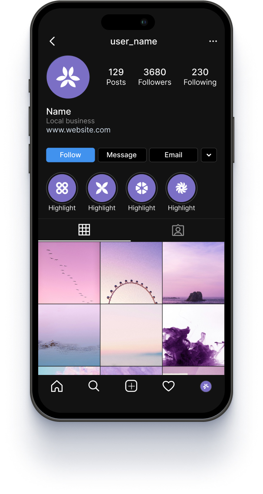

# Tasks: HTML CSS

## Task description

Your task is to create an HTML/CSS instagram profile according to the provided Figma design. An Iphone frame is being given to you. Put your solution inside it (follow the comments in `src/index.html` and `src/style.css` files). There is no need to do it pixel-perfect. Close to the original Figma design will be enough.

## Figma

[Figma link](<https://www.figma.com/design/3F0aWYwYQKQK1jtSsXRVFo/Instagram-profile-template--(Updated)-(Community)?node-id=508-38&t=WJf6o9lsYwkyzuS8-0>)

  
Design to be implemented

   

Design to be implemented you could find in the Profile section on the left navigation menu (Pages -> Profile)

## Evaluation criterias - max 10 points

- Implemented row with user_name - 1 points
- Implemented row with Profile Photo, 129 posts, 3680 Followers and 230 Following - 1 points
- Implemented row with Name, Local business, www.website.com - 1 points
- Implemented row with buttons Follow, Message, Email - 1 points
- Implemented row with stories highlights - 1 points
- Implemented image gallery - 4 points
- Implemented row with navigation icons - 1 points
